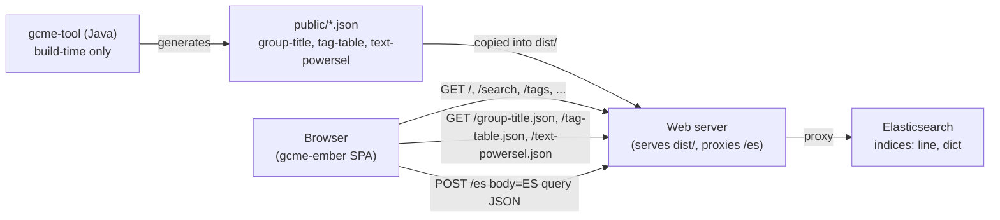
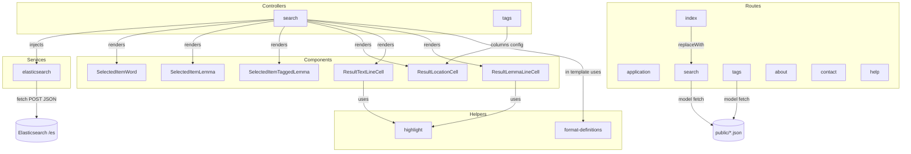

# Design: Ember 6.12 LTS Upgrade for `gcme-ember`

## Overview

The `gcme-ember` application is a single-page Ember UI for the Glossarial Concordance to Middle English. It currently sits on Ember 3.1 (2018) with several long-deprecated build addons, runtime jQuery, and classic-Ember idioms throughout. This design upgrades the application to Ember 6.12 LTS, replaces jQuery and `ember-ajax` with the native `fetch` API, refreshes every transitive dependency, and converts every route, controller, component, and template to Ember Octane idioms (native classes, `@tracked`, `@action`, Glimmer components, angle-bracket invocation, `<LinkTo>`, `{{on}}`).

The upgrade is scoped to the `gcme-ember/` directory and the top-level CI / documentation files. The Java-side data tooling (`gcme-tool/`) and the static JSON it produces (`group-title.json`, `tag-table.json`, `text-powersel.json`) are out of scope. Production deployment continues to depend on a web server proxying `/es` to Elasticsearch.

The driving design principles are:

1. **Minimum-risk upgrade.** Stay on the classic Ember CLI build for this iteration; document Embroider as future work. Keep popular addons (`ember-power-select`, `ember-models-table`) and only replace those that have no maintained line for Ember 6.x (`ember-ajax`, `ember-cli-eslint`, `ember-cli-qunit`, `ember-cli-shims`, `ember-welcome-page`, `ember-font-awesome`, `hoek`).
2. **Modern idioms where they pay off.** Convert all hand-written modules to Octane (`@tracked`, native getters, `@action`, Glimmer components, angle-bracket invocation). This satisfies Requirement 6 and unblocks the Ember 7.x runway.
3. **Native `fetch` everywhere.** Centralize HTTP in `services/elasticsearch.js` and the model hooks of `routes/search.js` and `routes/tags.js`. No jQuery, no `ember-ajax`, no top-level `$.ajax` invocations at module load.
4. **Behavior preservation.** Every user-visible feature listed in Requirement 7 keeps working: navigation, autocompletion across three input types, the four search query toggles (require-all, sort-logical, restrict, paging), result table rendering, the grouped tags table, and the redirect from `/` to `/search`.
5. **Test what we can verify automatically.** Add focused QUnit tests for the rendered nav, plus stubbed-`fetch` unit tests of the Elasticsearch service. Use property-based testing with `fast-check` for the search controller's pure query-construction logic, where input variation reveals real bugs (off-by-one in `from`, missing `must`/`should` branches, restrict/sort/clear invariants).

This document describes the target architecture, the per-module refactor, the correctness properties for property-based tests, the error handling model, the testing strategy, and the migration order that keeps the app buildable at every step.

## Architecture

### High-level deployment

The runtime topology is unchanged by this upgrade. The browser loads static assets from a web server. Static JSON (`group-title.json`, `tag-table.json`, `text-powersel.json`) is generated by `gcme-tool` and copied into `gcme-ember/public/` at build time. At runtime, the SPA hits Elasticsearch through a server-proxied `/es` path in production, or the absolute URL in `ENV.gcme.elasticsearch` (default `http://localhost:9200/_search`) in development.



### Module-level architecture (post-upgrade)



### Search submission sequence

```mermaid
sequenceDiagram
  participant U as User
  participant T as search.hbs
  participant Ctl as SearchController
  participant ES as ElasticsearchService
  participant F as window.fetch
  participant Server as /es proxy

  U->>T: clicks "Search"
  T->>Ctl: {{on "click" this.executeQuery}}
  Ctl->>Ctl: build query (from, size, must/should, filter, sort)
  alt no terms selected
    Ctl-->>T: set searchError = "term required"; do NOT call ES
  else has terms
    Ctl->>ES: executeQuery(query)
    ES->>F: fetch(search_uri, {method:'POST', headers, body, signal})
    F->>Server: POST /es
    Server-->>F: 200 + JSON | non-2xx | network error
    alt 2xx + valid JSON
      F-->>ES: Response
      ES-->>Ctl: parsed JSON
      Ctl->>Ctl: @tracked result; pageCount = ceil(total/pageSize)
      Ctl-->>T: render hits or "No matches"
    else 4xx/5xx, abort, parse error
      F-->>ES: rejection
      ES-->>Ctl: Error
      Ctl->>Ctl: @tracked searchError = msg; preserve prior result
      Ctl-->>T: render error banner
    end
  end
```

### Build-system decision

We will stay on the **classic Ember CLI 6.12 build** (Broccoli + ember-auto-import) rather than jumping to Embroider for this upgrade. Reasons:

- Minimum-risk path. Embroider on a 7-year-stale app is a separate project; bundling a runtime upgrade with a build-system swap multiplies failure modes.
- All retained addons (`ember-power-select` 8.x, `ember-models-table` 4.x) ship classic-build-compatible v2 addon packaging.
- Requirements 1 and 5 only constrain `ember-source`/`ember-cli` ranges and addon Ember 6.x compatibility, not the build implementation.

We will document Embroider migration as future work in `gcme-ember/DEPRECATIONS.md` once any classic-only deprecation surfaces (none expected at 6.12).

### ESLint configuration decision

`ember-cli-eslint` is removed in Ember 6.x (Requirement 5.2). We will use a **root flat config** at `gcme-ember/eslint.config.js` running on **ESLint 9.x** with `eslint-plugin-ember` 12.x (the line that supports Ember Octane / 6.x). Rationale:

- `eslint-plugin-ember` 12.x supports both legacy `.eslintrc.cjs` and flat config; flat config is the supported path going forward.
- Requirement 6.9 demands `ember/no-classic-classes`, `ember/no-classic-components`, and `ember/no-jquery` at error level. All three exist in `eslint-plugin-ember` 12.x.
- Requirement 10.2 demands `npm run lint` to fail on warnings. We will run `eslint . --max-warnings=0`.

If `eslint-plugin-ember` 12.x's flat config story turns out to require workarounds at install time, we will fall back to `.eslintrc.cjs` with ESLint 8.x and document the choice in `gcme-ember/DEPRECATIONS.md`. Both paths satisfy the requirement.

### Bootstrap / jQuery removal in `index.html`

The current `app/index.html` loads Bootstrap 4.6 CSS, jQuery slim, Popper, and Bootstrap 4 JS from a CDN. Bootstrap 4's collapse plugin (used by the navbar toggler) requires jQuery. We will:

- **Upgrade to Bootstrap 5** via CDN (`bootstrap@5.3.x`). Bootstrap 5 has no jQuery dependency and bundles Popper in `bootstrap.bundle.min.js`. This is the cleanest way to satisfy Requirement 3 (no jQuery) without writing custom navbar JS.
- Update `data-toggle` → `data-bs-toggle` and `data-target` → `data-bs-target` in `application.hbs`.
- Drop the `<script src=".../jquery.slim.min.js">` and `<script src=".../popper.min.js">` tags entirely from `app/index.html`.
- Keep CDN delivery, but pin to a fixed minor version with SRI integrity hashes (matching the current pattern). Vendoring Bootstrap into the app build is out of scope for this upgrade.
- Visual / interactive verification of the navbar collapse, dropdowns, and any utility classes whose names changed between Bootstrap 4 and 5 is required at the end of the migration. Class-name diffs we expect to touch:
  - `mr-auto` → `me-auto` (logical-property utilities).
  - `.form-group` is removed; spacing utilities (`mb-3`) replace it.
  - `.form-check-inline` and `.form-check-input`/`.form-check-label` survive but with slightly different markup expectations.

  We will sweep `application.hbs`, `search.hbs`, and `tags.hbs` for these.

### Addon-replacement decisions

| Current addon                | Status                  | Action                                                                                                                              |
| ---------------------------- | ----------------------- | ----------------------------------------------------------------------------------------------------------------------------------- |
| `ember-source` 3.1           | ⟶                      | Bump to `~6.12.0`.                                                                                                                  |
| `ember-cli` 3.1              | ⟶                      | Bump to `~6.12.0`.                                                                                                                  |
| `ember-data` 3.1             | unused at runtime       | Remove. The app does not use `@ember-data/store`; it speaks raw ES responses.                                                       |
| `ember-cli-babel` 6          | ⟶                      | Bump to `^8.x` (compatible with Ember 6.12).                                                                                        |
| `ember-cli-htmlbars` 2       | ⟶                      | Bump to `^6.x` (compat with Ember 6.12).                                                                                            |
| `ember-cli-htmlbars-inline-precompile` 1 | merged           | Remove; now part of `ember-cli-htmlbars`.                                                                                           |
| `ember-cli-eslint` 4         | removed                 | Replace with root `eslint.config.js` + `eslint-plugin-ember` 12.x + `npm run lint` script (Req 5.2, 10.1).                          |
| `ember-cli-qunit` 4          | removed                 | Replace with `ember-qunit` 9.x + `qunit-dom` 3.x + `@ember/test-helpers` 4.x (Req 5.4, 9.6).                                        |
| `ember-cli-shims` 1          | removed                 | Drop; AMD shims no longer needed under modern Ember CLI (Req 5.5).                                                                  |
| `ember-cli-app-version`      | ⟶                      | Bump to current. Used by `{{app-version}}` in `application.hbs`.                                                                    |
| `ember-cli-dependency-checker` | ⟶                    | Bump to current.                                                                                                                    |
| `ember-cli-inject-live-reload` | ⟶                    | Bump to current.                                                                                                                    |
| `ember-cli-uglify` 2         | replaced                | Use `ember-cli-terser` (the maintained replacement under Ember 4+).                                                                 |
| `ember-cli-sri`              | ⟶                      | Bump to current; preserves CSS/JS asset integrity attributes.                                                                       |
| `ember-resolver` 4           | ⟶                      | Bump to ^13.x (compatible with Ember 6.12).                                                                                         |
| `ember-load-initializers`    | ⟶                      | Bump to ^3.x.                                                                                                                       |
| `ember-export-application-global` | ⟶                  | Bump to current.                                                                                                                    |
| `ember-maybe-import-regenerator` | obsolete              | Remove. Modern Ember CLI does not require it.                                                                                       |
| `ember-welcome-page`         | removed                 | Remove (Req 5.6). The app's `application.hbs` does not invoke it.                                                                   |
| `ember-font-awesome` 4-rc    | unused at runtime       | Remove (Req 5.12 alternative). Templates do not reference any FA component or class. If a future need emerges, use `@fortawesome/ember-fontawesome`. |
| `ember-ajax` 3               | removed                 | Remove. All HTTP migrates to `fetch` (Req 4.10).                                                                                    |
| `ember-models-table` 2.5     | upgraded                | Bump to `^4.x` (`ember-source` peer ≥ 4 LTS, supports Octane and angle-bracket invocation). Update template to `<ModelsTable .../>` and use the built-in Bootstrap 5 theme. |
| `ember-power-select` 2       | upgraded                | Bump to `^8.x` (Octane / Ember 6 compatible, supports angle-bracket `<PowerSelectMultiple .../>` and named `@selectedItemComponent`). |
| `popper.js` 1                | removed                 | No longer imported in JS. Bootstrap 5 bundles Popper for tooltips/dropdowns.                                                        |
| `loader.js`                  | dependency-of-dependency | Drop direct entry; modern ember-cli pulls it transitively.                                                                          |
| `broccoli-asset-rev`         | replaced                | Modern Ember CLI handles fingerprinting via built-in fingerprint config; remove direct entry.                                       |
| `hoek`                       | removed                 | Remove (Req 5.7). It is a stale, unused top-level dep.                                                                              |
| `jquery`                     | removed                 | Remove (Req 3.3).                                                                                                                   |

The version targets above are the published lines that declare `peerDependencies.ember-source` ranges satisfied by `^6.12.0`. The exact patches will be pinned by `package-lock.json` generated during the migration.

## Components and Interfaces

### Routes

#### `routes/application.js`

Currently absent (uses default). After upgrade, no application route is needed: the navigation lives entirely in `application.hbs` as `<LinkTo />` elements; there is no application-level data load.

#### `routes/index.js`

Native-class route whose only job is to redirect `/` to `/search` (Req 7.2). Equivalent of the current implementation, but in Octane idiom.

```js
import Route from '@ember/routing/route';

export default class IndexRoute extends Route {
  beforeModel() {
    this.replaceWith('search');
  }
}
```

#### `routes/search.js`

The current implementation is broken-by-luck: `$.ajax({url: '/text-powersel.json'})` runs at **module load time**, not on each route activation. The promise is captured as a property and reused for every visit. We replace that with proper lazy fetches inside `model()` using `fetch` and `Promise.all`. (Req 4.5, 4.8.)

```js
import Route from '@ember/routing/route';

const TIMEOUT_MS = 30_000;

async function fetchJson(url) {
  const ctl = new AbortController();
  const timer = setTimeout(() => ctl.abort(), TIMEOUT_MS);
  try {
    const res = await fetch(url, { signal: ctl.signal });
    if (!res.ok) {
      throw new Error(`Request to ${url} failed: ${res.status} ${res.statusText}`);
    }
    return await res.json();
  } catch (err) {
    throw new Error(`Request to ${url} failed: ${err.message}`);
  } finally {
    clearTimeout(timer);
  }
}

export default class SearchRoute extends Route {
  async model() {
    const [restrictData, groupTitleMap] = await Promise.all([
      fetchJson('/text-powersel.json'),
      fetchJson('/group-title.json'),
    ]);
    return { restrictData, groupTitleMap };
  }
}
```

The route's error path bubbles to Ember's standard `error` substate; `application.hbs` will surface it via the standard `error` template if needed. The search controller will additionally render a banner when its own search request errors.

#### `routes/tags.js`

Same pattern; reads `/tag-table.json` (Req 4.6). On error, returns a sentinel that the template can render as "tag reference table could not be loaded" (Req 7.19). Simplest: re-throw, and add a `templates/tags-loading-error.hbs` plus a `setupController(controller, model)` that catches via `error` action. Concretely we use `model()` returning `{ rows }` on success and an `@action error(err)` action on the route that sets a tracked flag on the controller.

```js
import Route from '@ember/routing/route';
import { action } from '@ember/object';

export default class TagsRoute extends Route {
  async model() {
    return { rows: await fetchJson('/tag-table.json') };
  }

  @action
  error(err) {
    // Set a flag on the controller so tags.hbs can render an inline error.
    const controller = this.controllerFor('tags');
    controller.loadError = err.message ?? 'Could not load tag reference table.';
    return false; // do not bubble to application error route
  }
}
```

#### Other routes

`routes/about.js`, `routes/contact.js`, `routes/help.js`: empty `Route` subclasses (or just rely on convention). Templates remain static content. We will write them as native classes for lint cleanliness even though no body is required.

### Controllers

#### `controllers/search.js`

Decision: **keep a controller**, do not relocate state into a top-level Glimmer component invoked from `search.hbs`. Reasons:

- The state (`words`, `lemmas`, `tagged_lemmas`, `restrict`, `result`, `pageNumber`) belongs to the search route and should survive a transition away to `/about` and back. A controller is exactly the right Ember idiom for that.
- Future query-param work (deep-linking the current search) is a controller affordance and would be lost in a top-level component.
- Requirement 6.8 explicitly permits either choice; we pick (a) the Octane controller, with `@tracked` and `@action`.

The Octane controller:

```js
import Controller from '@ember/controller';
import { service } from '@ember/service';
import { action } from '@ember/object';
import { tracked } from '@glimmer/tracking';

export default class SearchController extends Controller {
  @service elasticsearch;

  @tracked words = null;
  @tracked lemmas = null;
  @tracked tagged_lemmas = null;
  @tracked restrict = null;
  @tracked requireAllWords = false;
  @tracked sortLogical = false;
  @tracked pageSize = 25;          // Req 7.6
  @tracked pageNumber = 1;
  @tracked pageCount = 0;
  @tracked result = null;
  @tracked searchError = null;     // surfaced when fetch fails or no terms

  // Native getters replace computed properties (Req 6.7).
  get hasResults() { return this.result?.hits?.total > 0; }
  get hasNoMatches() { return this.result != null && this.result.hits.total === 0; }
  get isFirstPage() { return this.pageNumber <= 1; }
  get isLastPage() { return this.pageNumber >= this.pageCount; }
  get pageFirstMatchNumber() { return (this.pageNumber - 1) * this.pageSize + 1; }
  get pageLastMatchNumber() {
    return Math.min(this.pageNumber * this.pageSize, this.result?.hits?.total ?? 0);
  }
  get resultColumns() { /* same shape as today; reads this.model.groupTitleMap */ }

  // Pure builder; trivial to property-test.
  buildQuery() { /* see Data Models */ }

  hasAnyTerms() {
    return (this.words?.length ?? 0) + (this.lemmas?.length ?? 0) + (this.tagged_lemmas?.length ?? 0) > 0;
  }

  @action async submitSearch() {
    this.pageNumber = 1;
    await this.runQuery();
  }

  @action async nextPage() {
    if (this.isLastPage) return;             // Req 7.11
    this.pageNumber += 1;
    await this.runQuery();
  }

  @action async prevPage() {
    if (this.isFirstPage) return;            // Req 7.12
    this.pageNumber -= 1;
    await this.runQuery();
  }

  @action clearQuery() {                     // Req 7.13
    this.words = null;
    this.lemmas = null;
    this.tagged_lemmas = null;
    this.restrict = null;
    this.result = null;
    this.pageNumber = 1;
    this.searchError = null;
  }

  @action completeWord(prefix) { return this.elasticsearch.complete('word', prefix); }
  @action completeLemma(prefix) { return this.elasticsearch.complete('lemma', prefix); }
  @action completeTaggedLemma(prefix) { return this.elasticsearch.complete('lemma_tag', prefix); }

  @action selectOnSpace(select, e) { /* unchanged */ }

  async runQuery() {
    if (!this.hasAnyTerms()) {                                  // Req 7.17
      this.searchError = 'Enter at least one word, headword, or tagged headword.';
      return;
    }
    this.searchError = null;
    const query = this.buildQuery();
    try {
      const result = await this.elasticsearch.executeQuery(query);
      this.result = result;
      this.pageCount = Math.max(1, Math.ceil((result.hits.total ?? 0) / this.pageSize));
    } catch (err) {                                             // Req 7.18
      this.searchError = `Search service unavailable: ${err.message}`;
      // Intentionally do not clobber this.result, this.pageNumber, or the selection state.
    }
  }
}
```

`pageSize` defaults to 25 with bounds 1..100 (Req 7.6). The bounds are enforced by a setter or by the view layer; we keep them in a setter for safety:

```js
get pageSize() { return this._pageSize; }
set pageSize(v) { this._pageSize = Math.min(100, Math.max(1, v ?? 25)); }
```

(With `@tracked _pageSize = 25` as the backing field.)

#### `controllers/tags.js`

Octane controller. Holds the `columns` and `groupProperties` configuration (formerly built in `init()`) as native getters, plus a `@tracked loadError = null` field for Req 7.19.

```js
import Controller from '@ember/controller';
import { tracked } from '@glimmer/tracking';

export default class TagsController extends Controller {
  @tracked loadError = null;

  get columns() {
    return [
      { title: 'Tag', propertyName: 'tag' },
      { title: 'Description', propertyName: 'description' },
    ];
  }
  get groupProperties() { return [{ label: 'Type', value: 'group' }]; }
}
```

`Bootstrap4Theme.create()` is removed; `ember-models-table` 4.x ships a built-in Bootstrap 5 theme that we configure in the template via `@themeInstance` or by relying on the default.

### Components (Glimmer)

All six components currently in the app will be converted. Three are pure template-only spans; three are template-only models-table cells.

#### `components/selected-item-word.{hbs,js}`

Currently a classic component with `tagName: 'span'` plus a template printing `{{option._match}}`. In Octane, the `tagName` idiom is gone: emit your own `<span>` in the template and delete the `.js` file. This is a **template-only component**. Same treatment for `selected-item-lemma` and `selected-item-tagged-lemma`.

```hbs
{{!-- app/components/selected-item-word.hbs (template-only) --}}
<span>{{@option._match}}</span>
```

```hbs
{{!-- app/components/selected-item-lemma.hbs --}}
<span>{{@option.lemma}}</span>
```

```hbs
{{!-- app/components/selected-item-tagged-lemma.hbs --}}
<span>{{@option.lemma_tag}}</span>
```

These components are passed by `ember-power-select` 8.x via `@selectedItemComponent={{component "selected-item-word"}}` (or by the helper class). The `@option` arg is the convention used by `ember-power-select` 8.x for the rendered option.

#### `components/result-location-cell.{hbs,js}`, `components/result-text-line-cell.{hbs,js}`, `components/result-lemma-line-cell.{hbs,js}`

Currently exist only as templates referenced by `component: 'name'` in `ember-models-table` column config. With models-table 4.x:

- Cell components are still referenced by name in the column config.
- The component receives `@record` (the row) and `@column` (the column config) as args (this replaces the old `record`/`column` properties on a classic component).
- Templates need to use `@record.*` and `@column.*` instead of `record.*` and `column.*`.

We make them template-only Glimmer components (no `.js` needed) so the change is purely a template refactor.

```hbs
{{!-- app/components/result-text-line-cell.hbs --}}
{{#if @record.highlight.text}}
  {{highlight @record.highlight.text}}
{{else}}
  {{@record._source.text}}
{{/if}}
```

```hbs
{{!-- app/components/result-lemma-line-cell.hbs --}}
{{#if @record.highlight.tag_lemma_text}}
  {{highlight @record.highlight.tag_lemma_text}}
{{else}}
  {{@record._source.lemma_tag_text}}
{{/if}}
```

```hbs
{{!-- app/components/result-location-cell.hbs --}}
{{!-- Show top group and most-specific group. Groups are 2..4 entries. --}}
{{get @column.groupTitleMap (get @record._source.group "0")}}
-
{{#if (get @column.groupTitleMap (get @record._source.group "3"))}}
  {{get @column.groupTitleMap (get @record._source.group "3")}}
{{else if (get @column.groupTitleMap (get @record._source.group "2"))}}
  {{get @column.groupTitleMap (get @record._source.group "2")}}
{{else}}
  {{get @column.groupTitleMap (get @record._source.group "1")}}
{{/if}}
```

The `groupTitleMap` reaches the cell via the `resultColumns` config; we put it on the column entry so it is available as `@column.groupTitleMap`.

### Services

#### `services/elasticsearch.js`

Native-class service. Reads `ENV.gcme.elasticsearch` via a getter so tests and dev environments can override `ENV` cleanly. Wraps `fetch` with an `AbortController`-backed 30-second timeout (Req 4.1). Maps response classes per Reqs 4.2–4.4 and 4.7–4.9.

```js
import Service from '@ember/service';
import ENV from 'gcme-ember/config/environment';

const TIMEOUT_MS = 30_000;

export default class ElasticsearchService extends Service {
  // Indirection so tests can override.
  get search_uri() { return ENV.gcme.elasticsearch; }

  async executeQuery(query) {
    const url = this.search_uri;
    if (typeof url !== 'string' || url.length === 0) {           // Req 8.4
      throw new Error('Elasticsearch endpoint configuration is missing or invalid.');
    }

    const ctl = new AbortController();
    const timer = setTimeout(() => ctl.abort(), TIMEOUT_MS);

    let res;
    try {
      res = await fetch(url, {
        method: 'POST',
        headers: { 'Content-Type': 'application/json; charset=utf-8' },
        body: JSON.stringify(query),
        signal: ctl.signal,
      });
    } catch (err) {                                              // Req 4.4
      throw new Error(`Elasticsearch request failed: ${err.message}`);
    } finally {
      clearTimeout(timer);
    }

    if (!res.ok) {                                               // Req 4.3
      throw new Error(`Elasticsearch request failed: ${res.status} ${res.statusText}`);
    }

    try {
      return await res.json();                                   // Req 4.2
    } catch (err) {                                              // Req 4.4
      throw new Error(`Elasticsearch response was not valid JSON: ${err.message}`);
    }
  }

  async complete(term, prefix) {
    const query = {
      suggest: {
        term_suggest: {
          prefix,
          completion: { field: `${term}.suggest`, size: 10 },
        },
      },
    };

    const result = await this.executeQuery(query);
    const options = result.suggest?.term_suggest?.[0]?.options ?? [];   // Req 4.9
    return options.map((o) => {                                          // Req 4.7
      const src = { ...(o._source ?? {}), _match: o.text };
      return src;
    });
  }
}
```

The `complete` method is rewritten to be defensive about missing fields (defaulting to `[]`) so a successful-but-empty response yields `[]` instead of throwing.

### Helpers

`helpers/format-definitions.js` and `helpers/highlight.js` already use the modern `helper(...)` factory and need no functional change. We only update imports if `htmlSafe` is moved to `@ember/template` in the version of Ember we land on (it is in 6.12). We will also remove the trailing-empty-line ESLint nit if any.

```js
// helpers/highlight.js
import { helper } from '@ember/component/helper';
import { htmlSafe } from '@ember/template';

export default helper(([html]) => htmlSafe(html));
```

### Application template

`application.hbs` after upgrade:

```hbs
<div id="gcme-header" class="container-fluid">
  <nav class="navbar navbar-expand-lg navbar-light">
    
    <LinkTo @route="index" class="navbar-brand">
      Glossarial Concordance to Middle English<br>
      <small>The Works of Geoffrey Chaucer and the English Works of John Gower</small>
    </LinkTo>

    <button class="navbar-toggler" type="button"
            data-bs-toggle="collapse" data-bs-target="#navbarToggler"
            aria-controls="navbarToggler" aria-expanded="false" aria-label="Toggle navigation">
      <span class="navbar-toggler-icon"></span>
    </button>

    <div class="collapse navbar-collapse" id="navbarToggler">
      <ul class="navbar-nav me-auto">
        <li class="nav-item"><LinkTo @route="about"   class="nav-link">About</LinkTo></li>
        <li class="nav-item"><LinkTo @route="search"  class="nav-link">Search</LinkTo></li>
        <li class="nav-item"><LinkTo @route="tags"    class="nav-link">Tags</LinkTo></li>
        <li class="nav-item"><LinkTo @route="help"    class="nav-link">How To Guide</LinkTo></li>
        <li class="nav-item"><LinkTo @route="contact" class="nav-link">Contact</LinkTo></li>
      </ul>
    </div>
  </nav>
</div>

<div class="container-fluid">{{outlet}}</div>

<div class="container mt-4">
  <p class="text-center"><small>rev. {{app-version hideVersion=true}}</small></p>
</div>
```

The five labeled links satisfy Req 7.1 and the rendering test for Req 9.3.

### Search template

Major changes: angle-bracket invocation everywhere; `{{action}}` → `{{on}}` + `@action`; `{{input}}` → native `<input ...>` with `{{on "change" this.toggleX}}` (or `<Input>` from `@ember/component`); explicit no-matches and pagination guard branches; explicit error display for `searchError`.

Sketch:

```hbs
<div class="container">
  <h2>Compose query</h2>

  {{#if this.searchError}}
    <div class="alert alert-warning" role="alert">{{this.searchError}}</div>
  {{/if}}

  <form>
    <div class="mb-3">
      <label for="words" class="form-label">Middle English word(s)</label>
      <PowerSelectMultiple
        @selected={{this.words}}
        @onChange={{fn (mut this.words)}}
        @search={{this.completeWord}}
        @onKeydown={{this.selectOnSpace}}
        @searchField="none"
        @selectedItemComponent={{component "selected-item-word"}}
        @placeholder="Enter words."
        as |entry|>
        <strong>{{entry.word}}</strong> [{{entry.lemma_tag}}] - {{format-definitions entry.definition}}
      </PowerSelectMultiple>
      <small class="form-text text-muted">Match words as spelled in a given line of text.</small>
    </div>

    {{!-- analogous PowerSelectMultiple blocks for lemmas and tagged_lemmas --}}

    <div class="mb-3">
      <label for="restrict" class="form-label">Restrict to location</label>
      <PowerSelectMultiple
        @options={{this.model.restrictData}}
        @selected={{this.restrict}}
        @onChange={{fn (mut this.restrict)}}
        @searchField="label"
        @placeholder="Select locations"
        @allowClear={{true}}
        as |entry|>
        {{entry.label}}
      </PowerSelectMultiple>
    </div>

    <div class="form-check form-check-inline">
      <Input @type="checkbox" id="allWords" class="form-check-input" @checked={{this.requireAllWords}} />
      <label for="allWords" class="form-check-label">All words and headwords must be present in a line.</label>
    </div>

    <div class="form-check form-check-inline mb-2">
      <Input @type="checkbox" id="sort" class="form-check-input" @checked={{this.sortLogical}} />
      <label for="sort" class="form-check-label">Sort results by location instead of relevance.</label>
    </div>

    <div id="gcme-search-buttons">
      <button type="button" class="btn btn-secondary" {{on "click" this.clearQuery}}>Clear</button>
      <button type="button" class="btn btn-primary"   {{on "click" this.submitSearch}}>Search</button>
    </div>
  </form>

  {{#if this.result}}
    {{#if this.hasResults}}
      <h3 class="text-center">
        Matches {{this.pageFirstMatchNumber}}-{{this.pageLastMatchNumber}}
        of total {{this.result.hits.total}}
      </h3>

      <ModelsTable
        @data={{this.result.hits.hits}}
        @columns={{this.resultColumns}}
        @showComponentFooter={{false}}
        @showColumnsDropdown={{true}}
        @useFilteringByColumns={{false}}
        @showGlobalFilter={{false}}
        @pageSize={{this.pageSize}}
      />

      <nav id="gcme-search-pages" aria-label="Search result pages">
        <ul class="pagination justify-content-center">
          <li class="page-item {{if this.isFirstPage 'disabled'}}">
            <button type="button" class="page-link"
                    disabled={{this.isFirstPage}}
                    {{on "click" this.prevPage}}>Previous</button>
          </li>
          <li class="page-item disabled">
            <span class="page-link">Page {{this.pageNumber}} of {{this.pageCount}}</span>
          </li>
          <li class="page-item {{if this.isLastPage 'disabled'}}">
            <button type="button" class="page-link"
                    disabled={{this.isLastPage}}
                    {{on "click" this.nextPage}}>Next</button>
          </li>
        </ul>
      </nav>
    {{else}}
      <h3 class="text-center">No matches</h3>             {{!-- Req 7.14 --}}
    {{/if}}
  {{/if}}
</div>
```

Notes:

- `<button>` uses `disabled={{...}}` for the first/last page guard, so even an accidental double-click is a no-op (Req 7.11, 7.12).
- The clear button is `type="button"` to avoid a form submission. The original `type="submit"` was a bug (clicking Clear would also submit).
- "No matches" is rendered without pagination (Req 7.14).
- The error banner appears at the top so it does not push the results out of view.

### Tags template

```hbs
<div class="container">
  <h2>Tagging scheme</h2>

  {{#if this.loadError}}
    <div class="alert alert-warning" role="alert">{{this.loadError}}</div>
  {{else}}
    <p>Below is a list of all the tags used.</p>
    <ModelsTable
      @data={{this.model.rows}}
      @columns={{this.columns}}
      @showComponentFooter={{false}}
      @showColumnsDropdown={{false}}
      @useFilteringByColumns={{false}}
      @showGlobalFilter={{false}}
      @useDataGrouping={{true}}
      @dataGroupProperties={{this.groupProperties}}
      @currentGroupingPropertyName="group"
      @pageSize={{200}}
    />
  {{/if}}
</div>
```

### `index.html`

```html
<!DOCTYPE html>
<html>
  <head>
    <meta charset="utf-8">
    <meta http-equiv="X-UA-Compatible" content="IE=edge">
    <title>Glossarial Concordance to Middle English</title>
    <meta name="description" content="The Works of Geoffrey Chaucer and the English Works of John Gower">
    <meta name="viewport" content="width=device-width, initial-scale=1">

    {{content-for "head"}}

    <link integrity="" rel="stylesheet" href="{{rootURL}}assets/vendor.css">
    <link integrity="" rel="stylesheet" href="{{rootURL}}assets/gcme-ember.css">
    <link rel="stylesheet"
          href="https://cdn.jsdelivr.net/npm/bootstrap@5.3.3/dist/css/bootstrap.min.css"
          integrity="sha384-..." crossorigin="anonymous">

    {{content-for "head-footer"}}
  </head>
  <body>
    {{content-for "body"}}

    <script src="{{rootURL}}assets/vendor.js"></script>
    <script src="{{rootURL}}assets/gcme-ember.js"></script>
    <script src="https://cdn.jsdelivr.net/npm/bootstrap@5.3.3/dist/js/bootstrap.bundle.min.js"
            integrity="sha384-..." crossorigin="anonymous"></script>

    {{content-for "body-footer"}}
  </body>
</html>
```

The `bootstrap.bundle.min.js` includes Popper. No jQuery script tag (Req 3.4). SRI hashes are filled in at migration time from the official CDN.

### `config/environment.js`

```js
'use strict';

module.exports = function (environment) {
  const ENV = {
    modulePrefix: 'gcme-ember',
    environment,
    rootURL: '/',
    locationType: 'history',
    EmberENV: {
      EXTEND_PROTOTYPES: { Date: false },
      FEATURES: {},
    },
    APP: {},
  };

  ENV.gcme = { elasticsearch: 'http://localhost:9200/_search' };

  if (environment === 'test') {
    ENV.locationType = 'none';
    ENV.APP.LOG_ACTIVE_GENERATION = false;
    ENV.APP.LOG_VIEW_LOOKUPS = false;
    ENV.APP.rootElement = '#ember-testing';
    ENV.APP.autoboot = false;
  }

  if (environment === 'production') {
    ENV.gcme.elasticsearch = '/es';                    // Req 8.1
  }

  return ENV;
};
```

`EmberENV.jquery-integration` is **not set** because Ember 4+ defaults it to `false`; setting `@ember/optional-features` to omit `jquery-integration` is sufficient. Requirement 3.6 says set it to `false` "or its current equivalent flag" — we satisfy it by omitting jQuery from `package.json`, omitting `app.import` of jQuery, and not enabling the `jquery-integration` optional feature. The `dist/` JS will not contain jQuery (Req 3.7); we will add a build-time grep in CI to verify.

### `ember-cli-build.js`

Mostly unchanged. We may need to set `autoImport` options for `fast-check` (the test-only PBT library, see Testing Strategy):

```js
'use strict';

const EmberApp = require('ember-cli/lib/broccoli/ember-app');

module.exports = function (defaults) {
  const app = new EmberApp(defaults, {
    fingerprint: { enabled: true },
    'ember-cli-terser': { enabled: true },
    autoImport: {
      // fast-check is test-only; Ember CLI's auto-import resolves it from devDependencies.
    },
  });
  return app.toTree();
};
```

## Data Models

This is a UI app over a remote search API; the only "models" are the JSON shapes that flow between the controller, the service, the routes, and the static asset files. Documenting them prevents drift and is the basis for the property-based tests.

### Static asset shapes

```ts
// public/group-title.json
type GroupTitleMap = Record<string /* group id */, string /* title */>;

// public/tag-table.json
type TagTableRow = { tag: string; description: string; group: string };
type TagTable = TagTableRow[];

// public/text-powersel.json — feeds the Restrict input
type RestrictOption = { id: string; label: string; group?: string };
type RestrictData = RestrictOption[];
```

### `search` route model

```ts
type SearchRouteModel = {
  restrictData: RestrictData;
  groupTitleMap: GroupTitleMap;
};
```

### `tags` route model

```ts
type TagsRouteModel = { rows: TagTable };
```

### Power-select option shapes

Each `_match`-tagged option object exposed by `Elasticsearch_Service.complete`:

```ts
type PowerSelectOption = {
  _match: string;          // suggestion text (e.g. "mouen")
  word?: string;
  lemma?: string;
  lemma_tag?: string;
  definition?: string[];
  // ... any other ES `_source` fields
};
```

`words`, `lemmas`, `tagged_lemmas` on the controller are `PowerSelectOption[] | null`. `restrict` is `RestrictOption[] | null`.

### Elasticsearch query shape (the one the controller emits)

The query is the central object the property tests check. Its grammar:

```ts
type Term = { term: { text: string } | { lemma_text: string } | { lemma_tag_text: string } };

type SearchQuery = {
  from: number;            // (pageNumber - 1) * pageSize, ≥ 0
  size: number;            // pageSize, 1..100
  query: {
    bool: {
      must: { bool: { must?: Term[]; should?: Term[] } };  // exactly one of must/should is present
      filter?: { terms: { group: string[] } };             // present iff restrict.length > 0
    };
  };
  highlight: { fields: { text: {}; tag_lemma_text: {} } };
  sort?: [{ id: 'asc' }, { number: 'asc' }, { raw_number: 'asc' }];  // present iff sortLogical
};
```

Reference implementation of `buildQuery()` on the controller, which the property tests exercise:

```js
buildQuery() {
  const clauses = [];
  for (const o of this.words ?? [])         clauses.push({ term: { text: o._match } });
  for (const o of this.lemmas ?? [])        clauses.push({ term: { lemma_text: o._match } });
  for (const o of this.tagged_lemmas ?? []) clauses.push({ term: { lemma_tag_text: o._match } });

  const inner = this.requireAllWords ? { must: clauses } : { should: clauses };
  const query = {
    from: (this.pageNumber - 1) * this.pageSize,
    size: this.pageSize,
    query: { bool: { must: { bool: inner } } },
    highlight: { fields: { text: {}, tag_lemma_text: {} } },
  };

  if (this.restrict?.length) {
    query.query.bool.filter = { terms: { group: this.restrict.map((o) => o.id) } };
  }
  if (this.sortLogical) {
    query.sort = [{ id: 'asc' }, { number: 'asc' }, { raw_number: 'asc' }];
  }
  return query;
}
```

### Elasticsearch response shape (the one the service parses)

```ts
type SearchHit = {
  _source: { id: string; raw_number: string; number: number; group: string[]; text: string; lemma_tag_text: string; ... };
  highlight?: { text?: string[]; tag_lemma_text?: string[] };
};

type SearchResponse = {
  hits: { total: number; hits: SearchHit[] };
};

type SuggestResponse = {
  suggest: { term_suggest: [{ options: { text: string; _source: object }[] }] };
};
```

The service does not validate beyond "the response is JSON"; downstream consumers are tolerant of missing optional fields (e.g. cell components handle absent `highlight`).


## Correctness Properties

*A property is a characteristic or behavior that should hold true across all valid executions of a system — essentially, a formal statement about what the system should do. Properties serve as the bridge between human-readable specifications and machine-verifiable correctness guarantees.*

PBT applies cleanly to the pure logic in this app: the Elasticsearch query construction in `controllers/search.js`, the response-class behavior of `Elasticsearch_Service.executeQuery`, and the suggest-response transformation in `Elasticsearch_Service.complete`. We use **`fast-check`** as the PBT library, wrapped in QUnit `test()` blocks with `await fc.assert(fc.asyncProperty(...))`. Each property test runs a minimum of 100 iterations.

PBT does **not** apply to the build-system, lint, install, dependency-graph, and CI requirements (Reqs 1, 2, 3, 5, 9.1–9.2, 9.6–9.7, 10.x, 6.1–6.7, 6.9, 6.11). Those are configuration / one-shot checks and are covered by smoke tests and CI grep / lint rules.

### Property 1: Elasticsearch service outcome class

*For all* HTTP responses the stubbed `fetch` returns, `Elasticsearch_Service.executeQuery(query)` resolves with the parsed JSON body if and only if the status is in 200..299 and the body parses as JSON; in every other case it rejects with an `Error` whose message contains a description of the failure cause (and, for HTTP errors, the status code and status text).

**Validates: Requirements 4.2, 4.3, 4.4**

### Property 2: `complete` suggestion round-trip

*For any* stubbed Elasticsearch suggest response of the form `{ suggest: { term_suggest: [{ options: [{ text, _source }, ...] }] } }`, `Elasticsearch_Service.complete(term, prefix)` resolves to an array of the same length whose `i`-th element has `_match === options[i].text` and contains every other field of `options[i]._source`. When the options array is empty, the resolved value is `[]`.

**Validates: Requirements 4.7, 4.9**

### Property 3: Search query pagination offset invariant

*For any* `pageNumber ≥ 1`, `pageSize ∈ [1..100]`, and any non-empty selection of `words`, `lemmas`, `tagged_lemmas`, the query produced by `SearchController.buildQuery()` satisfies `query.from === (pageNumber - 1) * pageSize` and `query.size === pageSize`.

**Validates: Requirements 7.6, 7.11, 7.12**

### Property 4: `pageSize` bounds invariant

*For any* numeric input `v` (including `null`, `undefined`, negative values, `NaN`, and values greater than 100) assigned to `controller.pageSize`, the controller's `pageSize` getter returns a value in the range `[1, 100]`, with `25` returned for `null`/`undefined`/`NaN`.

**Validates: Requirements 7.6**

### Property 5: Boolean clause invariant

*For any* boolean value `requireAllWords` and any non-empty selection of `words`, `lemmas`, `tagged_lemmas`, exactly one of `query.query.bool.must.bool.must` or `query.query.bool.must.bool.should` is present in the constructed query, the present key contains a `term` clause for every selected option (with the per-list field mapping `words → text`, `lemmas → lemma_text`, `tagged_lemmas → lemma_tag_text`), and the present key is `must` if and only if `requireAllWords === true`.

**Validates: Requirements 7.7, 7.8**

### Property 6: Sort invariant

*For any* boolean value `sortLogical` and any non-empty term selection, `query.sort` is exactly `[{ id: 'asc' }, { number: 'asc' }, { raw_number: 'asc' }]` if `sortLogical === true`, and `query.sort` is `undefined` (the property is not set) otherwise.

**Validates: Requirements 7.9**

### Property 7: Restrict invariant

*For any* `restrict` value (an array of `{ id }` objects, possibly empty, or `null`) and any non-empty term selection, `query.query.bool.filter` is `{ terms: { group: restrict.map(o => o.id) } }` when `restrict` is a non-empty array, and `query.query.bool.filter` is `undefined` when `restrict` is `null`, `undefined`, or empty.

**Validates: Requirements 7.10**

### Property 8: Pagination boundary no-op

*For any* `pageNumber` and `pageCount` such that the controller is at a boundary (`pageNumber === 1` for `prevPage`, or `pageNumber === pageCount` for `nextPage`), invoking the boundary action mutates neither `pageNumber` nor any other tracked state on the controller, and issues zero calls to `Elasticsearch_Service.executeQuery`.

**Validates: Requirements 7.11, 7.12**

### Property 9: Clear-query reset invariant

*For any* prior controller state, after invoking `clearQuery()`, the controller's `words`, `lemmas`, `tagged_lemmas`, `restrict`, and `result` are all `null`, `pageNumber` is `1`, and `searchError` is `null`. (`pageSize`, `requireAllWords`, and `sortLogical` are user preferences and are intentionally not reset, matching the original behavior.)

**Validates: Requirements 7.13**

### Property 10: Empty-submission no-op invariant

*For any* prior controller state where `words`, `lemmas`, and `tagged_lemmas` are each `null` or an empty array, invoking `submitSearch()` issues zero calls to `Elasticsearch_Service.executeQuery`, leaves `result`, `pageNumber`, `restrict`, and the term selections unchanged, and sets `searchError` to a non-null user-readable string.

**Validates: Requirements 7.17**

### Property 11: Search-error preservation invariant

*For any* prior controller state with a non-null `result` and any rejection reason `r` from `Elasticsearch_Service.executeQuery`, after invoking `submitSearch()` (or `nextPage()` / `prevPage()` from a non-boundary page), the controller's `result`, `pageNumber`, `words`, `lemmas`, `tagged_lemmas`, and `restrict` are unchanged from their pre-invocation values, and `searchError` is a non-null string that contains the rejection's message.

**Validates: Requirements 7.18**

### Property 12: Location cell renders top and most-specific group titles

*For any* hit record whose `_source.group` is an array of 2..4 string ids, and any `groupTitleMap` that contains a title for every id in `_source.group`, the rendered output of `<ResultLocationCell @record={{record}} @column={{column}} />` (with `column.groupTitleMap` set) contains the title for `_source.group[0]` (the top-level group) and the title for `_source.group[_source.group.length - 1]` (the most-specific group), separated by `-`.

**Validates: Requirements 7.16**

## Error Handling

### Layered error model

Errors propagate from the network layer up through the service, the route, the controller, and finally to the template. The contract at each layer:

1. **Network layer (`fetch`).** A failing `fetch` call may resolve with a non-2xx `Response`, or reject with a `TypeError` (network failure / CORS / DNS), or resolve with a `Response` whose `.json()` rejects, or be aborted by our `AbortController` (timeout). Each is a distinct outcome.

2. **`Elasticsearch_Service.executeQuery`.** Maps every non-2xx-and-JSON outcome to a single rejected `Error` whose message includes the failure cause (HTTP status + statusText, or an abort marker, or the underlying `TypeError.message`). The resolved value is always the parsed JSON body. (Property 1.)

3. **`Elasticsearch_Service.complete`.** Defensive against missing fields in a 2xx response: a successful response with no `suggest.term_suggest[0].options` resolves to `[]` rather than throwing. Any rejection from `executeQuery` propagates unchanged. (Property 2 + Req 4.9.)

4. **Endpoint configuration.** When `search_uri` is `undefined`, `null`, an empty string, or a non-string, `executeQuery` rejects synchronously without issuing a `fetch` call (Req 8.4). The error message says "Elasticsearch endpoint configuration is missing or invalid".

5. **Routes.**
   - `routes/search.js` `model()` rejects when either of its two static-asset fetches rejects. The rejection message includes the failing URL. The user is taken to Ember's `application_error` substate (we will provide a minimal `templates/error.hbs`). The user can recover by reloading.
   - `routes/tags.js` traps the rejection in an `error` action that sets a tracked `loadError` on the tags controller (Req 7.19), so the page renders inline instead of triggering a full error substate.

6. **Search controller.**
   - `runQuery()` catches any rejection from `executeQuery`, sets `this.searchError = "Search service unavailable: ..."`, and **does not modify** `this.result`, `this.pageNumber`, `this.words`, `this.lemmas`, `this.tagged_lemmas`, or `this.restrict` (Req 7.18, Property 11).
   - `submitSearch()` checks `hasAnyTerms()` first; if no terms are selected, it sets `this.searchError = "Enter at least one word, headword, or tagged headword."` and returns without issuing a fetch (Req 7.17, Property 10).
   - `nextPage()` and `prevPage()` early-return on the corresponding boundary without firing a fetch (Req 7.11, 7.12, Property 8).
   - Autocomplete handlers (`completeWord`, `completeLemma`, `completeTaggedLemma`) propagate any rejection back to `ember-power-select`, which by convention renders an empty suggestion list. The error is also set on `searchError` so the user sees a banner.

7. **Templates.** Render an inline `<div class="alert alert-warning">{{this.searchError}}</div>` above the form on the search page; an inline alert above the tags table on the tags page. Pagination buttons use `disabled={{this.isFirstPage}}` / `disabled={{this.isLastPage}}` to make boundary clicks impossible.

### Specific error scenarios and outcomes

| Scenario                                        | Outcome                                                                                                  | Requirement |
| ----------------------------------------------- | -------------------------------------------------------------------------------------------------------- | ----------- |
| Search submitted with no selected terms         | `searchError` banner shown; no fetch; result/page preserved.                                             | 7.17        |
| Search returns 5xx                              | `searchError = "Search service unavailable: ..."`; result/page/selections preserved.                     | 7.18        |
| Search aborts after 30s                         | Same as 5xx.                                                                                             | 4.1, 4.4    |
| Search response is not valid JSON               | Same as 5xx.                                                                                             | 4.4         |
| Autocomplete request fails                      | Suggestion list empty; `searchError` banner shown.                                                       | 7.18        |
| `tag-table.json` request fails                  | `loadError` rendered; rest of UI unaffected.                                                             | 7.19        |
| `text-powersel.json` or `group-title.json` fail | `application_error` substate rendered; user reloads.                                                     | 4.5, 4.8    |
| `ENV.gcme.elasticsearch` missing in dev/test    | Synchronous rejection from service; no fetch; banner shown.                                              | 8.4         |
| Click "Next" on the last page                   | Disabled at the DOM level; `nextPage()` no-op even if invoked directly.                                  | 7.11        |
| Click "Previous" on page 1                      | Disabled at the DOM level; `prevPage()` no-op.                                                           | 7.12        |
| Search returns zero hits                        | `result` is set with `hits.total === 0`; "No matches" rendered; pagination not rendered.                 | 7.14        |

### Logging

There is no production telemetry layer in this app today; the upgrade does not introduce one. Errors surface in the UI banners and via `console.error` in the service catch blocks (the latter aids local debugging without leaking PII).

## Testing Strategy

### Test framework

- **`ember-qunit` 9.x + `qunit-dom` 3.x + `@ember/test-helpers` 4.x** for unit and rendering tests under `gcme-ember/tests/`. Each at the version line whose `peerDependencies.ember-source` is satisfied by `^6.12.0` (Reqs 9.6, 5.4).
- **`fast-check` ^3.x** for property-based tests, declared under `devDependencies`. fast-check works under QUnit by wrapping `fc.assert(fc.asyncProperty(...))` in `await` inside a normal `test()`.
- **No jQuery** (Req 9.7). The `tests/test-helper.js` and `tests/index.html` files do not import or depend on jQuery.

### Test layout

```
gcme-ember/tests/
├── helpers/
│   └── stub-fetch.js          // stubs window.fetch with a queue of responses
├── unit/
│   ├── services/
│   │   └── elasticsearch-test.js
│   ├── controllers/
│   │   └── search-test.js     // hosts properties 3..11
│   └── properties/
│       └── elasticsearch-properties-test.js  // hosts properties 1..2
├── integration/
│   └── components/
│       └── result-location-cell-test.js       // hosts property 12
├── rendering/
│   └── application-nav-test.js                // Req 9.3
├── acceptance/
│   ├── root-redirect-test.js                  // Req 7.2
│   └── tags-load-error-test.js                // Req 7.19
├── index.html
└── test-helper.js
```

### Unit tests for `Elasticsearch_Service`

Stub `window.fetch` with a deterministic mock:

```js
function stubFetchOnce({ status = 200, statusText = 'OK', body = {}, parseFails = false, networkError = null } = {}) {
  const original = window.fetch;
  window.fetch = (url, opts) => {
    if (networkError) return Promise.reject(networkError);
    return Promise.resolve({
      ok: status >= 200 && status < 300,
      status, statusText,
      json: () => parseFails ? Promise.reject(new SyntaxError('bad json')) : Promise.resolve(body),
    });
  };
  return () => { window.fetch = original; };
}
```

Examples (Reqs 9.4, 9.5):

- `executeQuery posts JSON to search_uri` — stubs a 200 response, calls `executeQuery({ a: 1 })`, asserts the recorded `fetch` call had `method='POST'`, `headers['Content-Type']='application/json; charset=utf-8'`, `body===JSON.stringify({a:1})`, and the resolved value deep-equals the stub body.
- `executeQuery rejects on non-2xx` — stubs a 503 with `statusText='Service Unavailable'`, asserts the rejection's `message` includes `503` and `Service Unavailable`.
- `executeQuery rejects on network error` — stubs `fetch` to reject with `new TypeError('failed')`, asserts the rejection message includes `failed`.
- `executeQuery rejects on parse error` — stubs a 200 whose `.json()` rejects, asserts the rejection message mentions JSON.
- `executeQuery rejects synchronously when search_uri is empty` — overrides the service's `search_uri` getter; asserts no `fetch` call was made.
- `complete passes 'word.suggest' / 'lemma.suggest' / 'lemma_tag.suggest'` — asserts the `field` in the suggest body matches the term argument.

Property tests using `fast-check` for Reqs 4.2, 4.3, 4.7, 4.9 (Properties 1 and 2):

```js
// elasticsearch-properties-test.js
import { module, test } from 'qunit';
import { setupTest } from 'ember-qunit';
import fc from 'fast-check';

module('Elasticsearch service | properties', function (hooks) {
  setupTest(hooks);

  test('Property 1: outcome class — Feature: ember-6-lts-upgrade, Property 1: executeQuery outcome class', async function (assert) {
    const service = this.owner.lookup('service:elasticsearch');
    await fc.assert(
      fc.asyncProperty(
        fc.integer({ min: 100, max: 599 }),
        fc.string(),
        fc.jsonValue(),
        fc.boolean(),
        async (status, statusText, body, parseFails) => {
          const restore = stubFetchOnce({ status, statusText, body, parseFails });
          try {
            const ok = status >= 200 && status < 300 && !parseFails;
            if (ok) {
              const v = await service.executeQuery({});
              assert.deepEqual(v, body);
            } else {
              await assert.rejects(service.executeQuery({}), Error);
            }
          } finally { restore(); }
        },
      ),
      { numRuns: 100 },
    );
  });

  test('Property 2: complete _match round-trip — Feature: ember-6-lts-upgrade, Property 2: complete suggestion round-trip', /* ... */);
});
```

### Unit tests for `SearchController` (Properties 3–11)

The controller is exercised in pure-JavaScript form; we instantiate it via the test container and replace its injected `elasticsearch` service with a stub that captures the submitted query.

```js
// search-test.js
import { module, test } from 'qunit';
import { setupTest } from 'ember-qunit';
import fc from 'fast-check';

const term = fc.record({ _match: fc.string({ minLength: 1, maxLength: 16 }) });
const termArr = fc.array(term, { maxLength: 5 });
const restrictArr = fc.array(fc.record({ id: fc.string({ minLength: 1, maxLength: 8 }) }), { maxLength: 5 });

module('controller:search | properties', function (hooks) {
  setupTest(hooks);

  test('Property 3: pagination offset — Feature: ember-6-lts-upgrade, Property 3: search query pagination offset invariant', async function (assert) {
    const ctrl = this.owner.lookup('controller:search');
    await fc.assert(fc.property(
      fc.integer({ min: 1, max: 1_000_000 }),
      fc.integer({ min: 1, max: 100 }),
      termArr.filter((a) => a.length > 0),
      (pageNumber, pageSize, words) => {
        ctrl.pageNumber = pageNumber; ctrl.pageSize = pageSize; ctrl.words = words;
        const q = ctrl.buildQuery();
        return q.from === (pageNumber - 1) * pageSize && q.size === pageSize;
      },
    ), { numRuns: 100 });
  });

  test('Property 5: boolean clause — Feature: ember-6-lts-upgrade, Property 5: boolean clause invariant', /* ... */);
  test('Property 6: sort — Feature: ember-6-lts-upgrade, Property 6: sort invariant', /* ... */);
  test('Property 7: restrict — Feature: ember-6-lts-upgrade, Property 7: restrict invariant', /* ... */);
  test('Property 8: pagination boundary — Feature: ember-6-lts-upgrade, Property 8: pagination boundary no-op', /* ... */);
  test('Property 9: clear reset — Feature: ember-6-lts-upgrade, Property 9: clear-query reset invariant', /* ... */);
  test('Property 10: empty submission — Feature: ember-6-lts-upgrade, Property 10: empty-submission no-op invariant', /* ... */);
  test('Property 11: error preservation — Feature: ember-6-lts-upgrade, Property 11: search-error preservation invariant', /* ... */);
});
```

For Properties 8, 10, and 11, the test substitutes the `elasticsearch` service with a recording stub:

```js
const calls = [];
this.owner.register('service:elasticsearch', class extends Service {
  executeQuery(q) { calls.push(q); return Promise.resolve({ hits: { total: 0, hits: [] } }); }
}, { instantiate: true });
```

For Property 11, the stub's `executeQuery` returns `Promise.reject(new Error(...))` and we assert the controller's `result`/`pageNumber`/selections are unchanged.

### Integration test for `ResultLocationCell` (Property 12)

Uses `setupRenderingTest` and `render(hbs\`<ResultLocationCell @record={{this.record}} @column={{this.column}} />\`)` plus a small `fast-check` generator for `_source.group` (length 2..4) and a synthesized `groupTitleMap`. Bounded at 50 iterations because rendering through `qunit-dom` is slower than pure-JS assertions. Asserts the rendered text includes the title for `group[0]` and the title for `group[group.length - 1]`.

### Rendering test for top navigation (Req 9.3)

```js
// rendering/application-nav-test.js
import { module, test } from 'qunit';
import { visit } from '@ember/test-helpers';
import { setupApplicationTest } from 'ember-qunit';

module('Application nav', function (hooks) {
  setupApplicationTest(hooks);

  test('renders the five top-nav links', async function (assert) {
    await visit('/search');
    for (const label of ['About', 'Search', 'Tags', 'How To Guide', 'Contact']) {
      const el = this.element.querySelector(`a.nav-link:contains("${label}")`)
        ?? [...this.element.querySelectorAll('a.nav-link')].find((a) => a.textContent.trim() === label);
      assert.ok(el, `link "${label}" is rendered`);
      assert.ok(el.getAttribute('href'), `link "${label}" has non-empty href`);
    }
  });
});
```

### Acceptance tests

- `acceptance/root-redirect-test.js`: visit `/`, assert `currentURL() === '/search'` (Req 7.2).
- `acceptance/tags-load-error-test.js`: stub `fetch('/tag-table.json')` to 500, visit `/tags`, assert the inline error alert is rendered (Req 7.19).

### Smoke tests / CI checks (in addition to QUnit)

- **Lint:** `npm run lint` — `eslint . --max-warnings=0` covers `ember/no-classic-classes`, `ember/no-classic-components`, `ember/no-jquery`, `ember/no-action-modifier`, `ember/no-link-to`, `ember/no-computed-properties-in-native-classes` (Reqs 6.1–6.7, 6.9).
- **No-jQuery sanity grep:** CI step that greps `dist/` for `jQuery v` / `jQuery.fn.jquery` and fails if present (Req 3.7), plus a grep across `app/`, `tests/`, `config/` for `jquery`, `\$\(`, `\$\.ajax`, `ember-ajax`.
- **`npm ls`:** CI step that asserts `ember-source@6.12.x` and `ember-cli@6.12.x` (Reqs 1.1–1.3).
- **`npm audit`:** CI step running `npm audit --omit=dev --audit-level=high` for Req 5.10. A non-zero exit fails the build.

### CI configuration

Replace `.travis.yml` with `.github/workflows/ci.yml`. We leave `.travis.yml` in place (updated to Node 20) as a fallback for the JHU CI mirror but the canonical config is GitHub Actions.

```yaml
# .github/workflows/ci.yml
name: ci
on:
  push: { branches: [master, main] }
  pull_request:
jobs:
  ember:
    runs-on: ubuntu-latest
    defaults: { run: { working-directory: gcme-ember } }
    steps:
      - uses: actions/checkout@v4
      - uses: actions/setup-node@v4
        with:
          node-version: '20.x'
          cache: 'npm'
          cache-dependency-path: gcme-ember/package-lock.json
      - run: npm ci
      - run: npm run lint
      - run: npm test
      - run: npm run build
      - name: assert no jQuery in dist
        run: |
          if grep -r --include='*.js' -E 'jQuery v|jQuery\.fn\.jquery' dist/; then exit 1; fi
  java:
    runs-on: ubuntu-latest
    steps:
      - uses: actions/checkout@v4
      - uses: actions/setup-java@v4
        with: { distribution: temurin, java-version: '17' }
      - run: GCME_DATA=../data mvn -B test
        working-directory: gcme-tool
```

(Reqs 10.5, 10.6.) The Java side is left unchanged in scope but its CI step is preserved.

### Documentation

- New `gcme-ember/README.md` documenting `npm install`, `npm run lint`, `npm test`, `npm run build`, `ember serve`, and the Node 20 requirement (Reqs 10.7, 2.6).
- Update root `README.md` deployment section to refer to Node 20 and the new commands; remove the Node 10 reference (Req 10.8).
- New `gcme-ember/DEPRECATIONS.md` for any post-6.12 deprecations that surface (Req 1.6) and any `npm audit` advisories without an upgrade path (Req 5.11). The file may be empty initially.

## Migration order

The migration is sequenced so that the app stays buildable at every step. Implementation tasks will follow this ordering:

1. Update `gcme-ember/package.json`: bump every dependency, remove the unused/replaced ones, add `engines.node = ">= 20.0.0 < 21.0.0"`, add `npm run lint` / `build` / `test` scripts. Run `npm install` once on Node 20 to generate `package-lock.json`.
2. Update `config/environment.js` (Bootstrap-5-friendly defaults; verify `ENV.gcme.elasticsearch`).
3. Update `ember-cli-build.js` (no jQuery import; terser; auto-import).
4. Replace `services/elasticsearch.js` with the fetch-based service.
5. Convert `routes/search.js`, `routes/tags.js`, `routes/index.js`, and the empty `about/contact/help` routes to native classes with proper `model()` hooks.
6. Convert `controllers/search.js` and `controllers/tags.js` to Octane.
7. Convert `app/components/*.js` to Glimmer (or delete `.js` for template-only).
8. Convert templates: `application.hbs`, `search.hbs`, `tags.hbs`, the cell templates, and the selected-item templates.
9. Update `app/index.html` (Bootstrap 5 CDN, drop jQuery and Popper script tags, update `data-toggle`/`data-target` in templates).
10. Replace `.eslintrc.js` with `eslint.config.js`; add npm `lint` script.
11. Add tests under `tests/` (rendering, unit, property, acceptance).
12. Add `.github/workflows/ci.yml`; update `.travis.yml` Node to 20.
13. Update root `README.md`; create `gcme-ember/README.md`.

After step 4 the app may temporarily fail at runtime (the controllers still use `this.get`); after step 6 it should run again end-to-end. Lint will fail until step 10 — that's expected and intentional.
