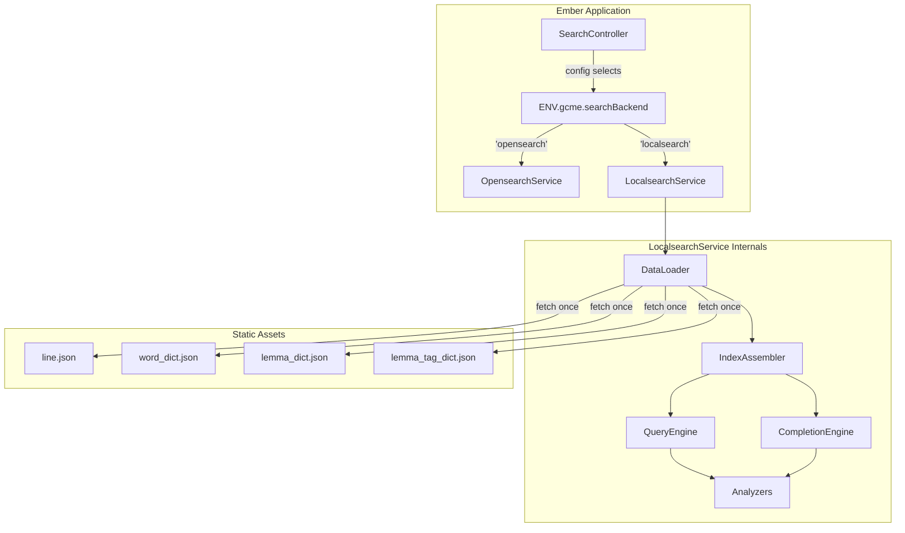

# Design Document: Local Search Service

## Overview

The `localsearch` service is a browser-side, drop-in replacement for the existing `opensearch` Ember service. It implements the same `executeQuery(query)` and `complete(term, prefix)` interface but executes all queries against in-memory data structures built from static JSON files. This eliminates the need for a running OpenSearch instance in environments where one is unavailable or unnecessary.

The service loads four JSON data files (`line.json`, `word_dict.json`, `lemma_dict.json`, `lemma_tag_dict.json`) lazily on first use, constructs inverted indexes and sorted completion arrays, and then answers all subsequent queries synchronously from memory. A configuration toggle (`ENV.gcme.searchBackend`) allows the search controller to select between backends without code changes.

## Architecture



### High-Level Data Flow

1. **Service injection**: The search controller injects the search service determined by `ENV.gcme.searchBackend`. When set to `'localsearch'`, it injects the `localsearch` service instance.
2. **Lazy loading**: On the first `executeQuery` or `complete` call, the service fetches all four JSON files via same-origin `fetch()`. Subsequent calls reuse the cached data.
3. **Index construction**: Once JSON data arrives, the service builds inverted indexes (token → integer index arrays) for line fields, and sorted completion arrays for dictionary suggest fields.
4. **Query execution**: The query engine interprets the OpenSearch query DSL subset used by the search controller — term queries, bool must/should, group filters, sorting, pagination, and highlighting.
5. **Completion execution**: The completion engine uses binary search on sorted arrays to find prefix matches efficiently, returning at most 10 results.

### Service Injection Strategy

Rather than using a dynamic service lookup or factory pattern, the search controller will use a computed service name pattern:

```javascript
// In search controller (simplified):
get searchService() {
  const backend = ENV.gcme.searchBackend || 'opensearch';
  return this[backend]; // references @service opensearch or @service localsearch
}
```

Both services are injected with `@service`, and the controller delegates to whichever one `ENV.gcme.searchBackend` selects. This is the simplest approach that keeps Ember's DI system happy and avoids owner.lookup at runtime.

## Components and Interfaces

### 1. LocalsearchService (Ember Service)

The public API that mirrors `OpensearchService`:

```typescript
interface LocalsearchService {
  executeQuery(query: OpenSearchQueryDSL): Promise<SearchResult>;
  complete(term: string, prefix: string): Promise<CompletionResult[]>;
}
```

Internal responsibilities:
- Manages the data-loading lifecycle (idle → loading → ready | failed)
- Delegates to QueryEngine and CompletionEngine once data is ready
- Queues calls that arrive while data is loading

### 2. DataLoader (Internal Module)

Handles fetching and caching of JSON data files:

```typescript
interface DataLoader {
  ensureLoaded(): Promise<LoadedData>;
}

interface LoadedData {
  lines: LineDoc[];
  wordDict: WordDictEntry[];
  lemmaDict: LemmaDictEntry[];
  lemmaTagDict: LemmaTagDictEntry[];
}
```

Lifecycle states:
- `idle` → no data loaded, no request in flight
- `loading` → fetch in progress, new callers queue behind the same promise
- `ready` → data loaded, indexes built
- `failed` → last load attempt failed; next call resets to `idle` and retries

### 3. Analyzers (Pure Functions)

Three text analysis functions, each taking a string and returning an array of tokens:

```typescript
function simpleAnalyzer(text: string): string[];
function whitespaceIgnoreCaseAnalyzer(text: string): string[];
function keywordAnalyzer(text: string): string[];
```

- **simpleAnalyzer**: Split on non-letter characters (`/[^a-zA-Z]+/`), lowercase each token, discard empty strings.
- **whitespaceIgnoreCaseAnalyzer**: Split on whitespace (`/\s+/`), lowercase each token, apply ASCII folding (e.g., `é` → `e`).
- **keywordAnalyzer**: Return the entire input as a single-element array (no splitting), lowercase.

### 4. IndexAssembler (Internal Module)

Builds inverted indexes and completion arrays from loaded data:

```typescript
interface InvertedIndex {
  // Map from analyzed token to array of integer indices into the source array
  tokenMap: Map<string, number[]>;
}

interface CompletionIndex {
  // Sorted array of { token: string, docIndex: number } for binary search
  entries: { token: string; docIndex: number }[];
}
```

### 5. QueryEngine (Internal Module)

Interprets the OpenSearch query DSL subset and executes against inverted indexes:

```typescript
interface QueryEngine {
  execute(query: OpenSearchQueryDSL, indexes: Indexes, lines: LineDoc[]): SearchResult;
}
```

Supported query DSL features:
- `query.bool.must.bool.must` / `query.bool.must.bool.should` — term clause combination
- `query.bool.filter.terms.group` — group filtering
- `sort` — multi-key sorting
- `from` / `size` — pagination
- `highlight.fields` — term highlighting

### 6. CompletionEngine (Internal Module)

Handles prefix-based autocomplete queries:

```typescript
interface CompletionEngine {
  complete(term: string, prefix: string, indexes: CompletionIndexes, dicts: Dicts): CompletionResult[];
}
```

Uses binary search on sorted completion arrays to find the first entry whose token starts with the given prefix, then scans forward collecting up to 10 matches.

## Data Models

### Line Document (from `line.json`)

```typescript
interface LineDoc {
  id: string;          // e.g. "CT-Kn"
  number: number;      // integer line number
  raw_number: string;  // original number notation (may include decimals, ranges)
  text: string;        // Middle English text
  lemma_text: string;  // space-separated lemma tokens
  lemma_tag_text: string; // space-separated lemma@tag tokens
  group: string[];     // array of group identifiers for this line
}
```

### Word Dictionary Entry (from `word_dict.json`)

```typescript
interface WordDictEntry {
  word: string;            // surface word form
  lemma_tag: string[];     // associated lemma tags
  definition: string[];    // definitions
}
```

### Lemma Dictionary Entry (from `lemma_dict.json`)

```typescript
interface LemmaDictEntry {
  lemma: string;           // headword lemma
  word: string[];          // surface forms attested for this lemma
  lemma_tag: string[];     // tagged forms
  definition: string[];    // definitions
}
```

### Lemma Tag Dictionary Entry (from `lemma_tag_dict.json`)

```typescript
interface LemmaTagDictEntry {
  lemma_tag: string;       // tagged form (e.g., "love@n")
  definition: string;      // definition text
  word: string[];          // attested surface forms
}
```

### Internal Index Structures

```typescript
// Primary data store — lines stored once, referenced by integer index
type LineArray = LineDoc[];

// Inverted index: token → sorted array of integer indices into LineArray
type InvertedIndex = Map<string, number[]>;

// Completion index: sorted array for binary-search prefix matching
interface CompletionEntry {
  token: string;      // lowercased/analyzed form for comparison
  docIndex: number;   // index into the corresponding dict array
}
type CompletionIndex = CompletionEntry[];
```

### OpenSearch Query DSL Subset (Input)

The query object shape produced by the search controller:

```typescript
interface QueryDSL {
  from?: number;       // default 0
  size?: number;       // default 25, max 100
  query: {
    bool: {
      must: {
        bool: {
          must?: TermClause[];    // AND combination
          should?: TermClause[];  // OR combination
        };
      };
      filter?: {
        terms: { group: string[] };
      };
    };
  };
  sort?: Array<{ [field: string]: 'asc' | 'desc' }>;
  highlight?: {
    fields: { [field: string]: {} };
  };
}

interface TermClause {
  term: { [field: string]: string };
}
```

### Search Result Shape (Output)

```typescript
interface SearchResult {
  hits: {
    total: { value: number; relation: 'eq' };
    hits: Array<{
      _source: LineDoc;
      highlight?: { [field: string]: string[] };
    }>;
  };
}
```

### Completion Result Shape (Output)

```typescript
interface CompletionResult {
  // All source fields of the matched dictionary entry
  [key: string]: any;
  // The matched suggestion text
  _match: string;
}
```

## Correctness Properties

*A property is a characteristic or behavior that should hold true across all valid executions of a system — essentially, a formal statement about what the system should do. Properties serve as the bridge between human-readable specifications and machine-verifiable correctness guarantees.*

### Property 1: Simple Analyzer Token Invariants

*For any* input string, the simple analyzer SHALL produce tokens that are all lowercase, contain only letter characters (`[a-z]+`), and whose concatenation covers all letter sequences in the input (no letters lost, no non-letters retained).

**Validates: Requirements 4.1, 4.5**

### Property 2: Whitespace Ignore Case Analyzer Token Invariants

*For any* input string, the whitespace_ignore_case analyzer SHALL produce tokens that are all lowercase, split only on whitespace boundaries, with Unicode diacritics folded to ASCII equivalents, and the number of tokens equals the number of whitespace-separated segments in the input (excluding leading/trailing whitespace).

**Validates: Requirements 4.2, 4.5**

### Property 3: Term Query Correctness

*For any* line dataset and *for any* term clause specifying a field and value, the set of results returned by `executeQuery` SHALL be exactly the set of lines whose analyzed field content contains the analyzed query term — no false positives (lines returned that don't contain the token) and no false negatives (lines omitted that do contain the token).

**Validates: Requirements 5.1, 5.2, 5.3, 5.6**

### Property 4: Bool Must is Intersection

*For any* set of term clauses combined with `bool.must`, the result set SHALL be the intersection of the individual result sets of each clause evaluated alone. That is, a line appears in the combined results if and only if it appears in every individual clause's results.

**Validates: Requirements 5.4, 5.8**

### Property 5: Bool Should is Union

*For any* set of term clauses combined with `bool.should`, the result set SHALL be the union of the individual result sets of each clause evaluated alone. That is, a line appears in the combined results if and only if it appears in at least one individual clause's results.

**Validates: Requirements 5.5**

### Property 6: Group Filter Narrows Results

*For any* query with a `filter.terms.group` containing a non-empty array of group identifiers, every result in `hits.hits` SHALL have at least one `group` value present in the filter array, AND `hits.total.value` SHALL equal the number of results satisfying both the term query and the group filter.

**Validates: Requirements 6.1, 6.3, 6.4**

### Property 7: Sort Ordering Correctness

*For any* query with a `sort` specification of `[{ id: "asc" }, { number: "asc" }, { raw_number: "asc" }]`, consecutive results in `hits.hits` SHALL satisfy the ordering: first by `id` lexicographic ascending, then by `number` numeric ascending, then by `raw_number` lexicographic ascending. Results with identical sort keys SHALL preserve their relative order from the original data array (stability).

**Validates: Requirements 7.1, 7.2, 7.3**

### Property 8: Pagination Slice Correctness

*For any* query with `from` and `size` parameters where `0 <= from` and `1 <= size <= 100`, the returned `hits.hits` SHALL be equivalent to taking the full sorted/filtered result set, skipping the first `from` elements, and taking at most `size` elements. Furthermore, `hits.total.value` SHALL always equal the total count of matching documents regardless of the `from`/`size` values.

**Validates: Requirements 8.1, 8.2, 8.3**

### Property 9: Highlighting Wraps Matched Tokens

*For any* query hit where `highlight.fields` includes a field name, the corresponding `highlight` entry SHALL contain the full field text with all and only the tokens matching the query wrapped in `<em>` tags. The non-highlighted portions of the text SHALL be identical to the original field value.

**Validates: Requirements 9.1, 9.2, 9.3, 9.4**

### Property 10: Completion Returns Prefix-Matching Entries

*For any* valid term (`"word"`, `"lemma"`, or `"lemma_tag"`) and *for any* non-empty prefix, every entry in the completion result SHALL have its suggest field value starting with the lowercased prefix (character-by-character from position 0), and no matching entry from the dataset that satisfies this prefix condition SHALL be omitted from the first 10 results in index order.

**Validates: Requirements 10.1, 10.2, 10.3, 10.5, 10.6, 10.7**

### Property 11: Completion Result Count Bound

*For any* `complete(term, prefix)` call, the returned array SHALL contain at most 10 elements.

**Validates: Requirements 10.4**

### Property 12: Round-Trip Equivalence with OpenSearch

*For any* query object in the shape produced by the search controller and *for any* identical dataset, the `localsearch` service SHALL return the same set of document IDs (in the same order when sorted) and the same `hits.total.value` as the `opensearch` service would return for the same query. Completion calls SHALL return the same `_match` values in the same order.

**Validates: Requirements 14.1, 14.2, 14.3, 14.4, 14.5**

## Error Handling

### Data Loading Errors

| Condition | Behavior |
|-----------|----------|
| Network failure fetching a data file | Reject all pending queries with `Error("Failed to load <filename>: <reason>")` |
| 30-second timeout during loading | Reject all pending queries with `Error("Data loading timed out")` |
| JSON parse failure | Reject all pending queries with `Error("Failed to parse <filename>")` |
| Previous load failed | Reset state to `idle`; next call re-attempts the full load |
| Insufficient memory | Propagate the native error (browser OOM); do not catch and silence |

### Query Execution Errors

| Condition | Behavior |
|-----------|----------|
| Data not yet loaded (first call) | Trigger lazy load, queue query, resolve after load completes |
| Invalid `from` (negative) | Reject with `Error("Invalid pagination: from must be >= 0")` |
| Invalid `size` (< 1 or > 100) | Reject with `Error("Invalid pagination: size must be between 1 and 100")` |
| Unknown field in term clause | Treat as matching no lines (return empty result set, not an error) |
| Malformed query structure | Reject with `Error("Invalid query structure: <description>")` |

### Completion Errors

| Condition | Behavior |
|-----------|----------|
| Invalid term name | Return `[]` (not an error) |
| Empty prefix | Return `[]` (not an error) |
| Data not loaded | Trigger lazy load, queue call, resolve after load |

### Configuration Errors

| Condition | Behavior |
|-----------|----------|
| `ENV.gcme.searchBackend` set to unrecognized value | Throw `Error("Invalid search backend: '<value>'. Must be 'opensearch' or 'localsearch'.")` at application boot |

## Testing Strategy

### Testing Framework

- **Unit/Integration tests**: QUnit via `ember-qunit` (already configured)
- **Property-based tests**: `fast-check` (already in `devDependencies` at version `^3.23.2`)

### Dual Testing Approach

**Unit tests** cover:
- Service registration and configuration switching
- Data loading lifecycle (queue, timeout, retry)
- Specific edge cases (empty inputs, unknown fields, invalid pagination)
- Integration between components (controller delegates to correct service)
- Highlighting with specific known inputs

**Property-based tests** cover:
- Analyzer correctness (Properties 1, 2)
- Query execution correctness (Properties 3, 4, 5, 6)
- Sort and pagination invariants (Properties 7, 8)
- Highlighting correctness (Property 9)
- Completion correctness (Properties 10, 11)
- Round-trip equivalence with a reference implementation (Property 12)

### Property Test Configuration

- Minimum **100 iterations** per property test
- Each property test tagged with: `Feature: local-search-service, Property {N}: {title}`
- Generators produce:
  - Random line documents with varying text content, group arrays, and numeric fields
  - Random term values including edge cases (empty, whitespace-only, Unicode diacritics)
  - Random query structures combining multiple term clauses with must/should
  - Random pagination parameters (valid and invalid)
  - Random prefixes for completion testing

### Test Organization

```
tests/
  unit/
    services/
      localsearch-test.js          # Service lifecycle, loading, error handling
      localsearch/
        analyzers-test.js          # Properties 1, 2 — analyzer correctness
        query-engine-test.js       # Properties 3, 4, 5, 6, 7, 8 — query execution
        highlighting-test.js       # Property 9 — highlighting
        completion-test.js         # Properties 10, 11 — completion
  integration/
    services/
      search-backend-test.js       # Property 12 — equivalence (requires test data)
      configuration-test.js        # Service switching, boot errors
```

### Test Data Strategy

- Property tests generate synthetic line data and dictionary data using fast-check arbitraries
- Arbitraries constrain generated data to be structurally valid (non-empty id, integer number, string text fields)
- A small fixture dataset (10–20 lines, 5–10 dictionary entries) is used for integration tests that verify end-to-end behavior
- Round-trip equivalence tests (Property 12) use a captured snapshot of real OpenSearch responses as the reference

